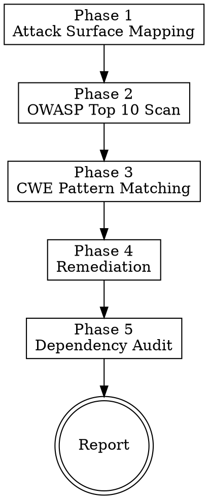

# Vulnerability Scan

> **Pillar**: Assure | **ID**: `assure-vulnerability-scan`

## Purpose

Security-focused code analysis mapping findings to OWASP Top 10 and CWE Top 25. Provides actionable remediation with severity scoring, not just warnings.

## Activation Triggers

- "security review", "vulnerability scan", "is this secure", "owasp check"
- "audit for security", "cwe check", "pentest this code"
- Automatically chained when `code-quality` detects security-adjacent patterns

## Methodology

### Process Flow



### Phase 1 — Attack Surface Mapping
1. Identify all entry points: API endpoints, user inputs, file uploads, URL params
2. Map data flow from input → processing → storage → output
3. Identify trust boundaries (authenticated vs. unauthenticated, internal vs. external)
4. List dependencies and their known vulnerability status

### Phase 2 — OWASP Top 10 Scan
Check each applicable category:

| ID | Category | What to Look For |
|---|---|---|
| A01 | Broken Access Control | Missing auth checks, IDOR, privilege escalation |
| A02 | Cryptographic Failures | Weak hashing, plaintext secrets, poor TLS config |
| A03 | Injection | SQL/NoSQL/OS/LDAP injection, template injection |
| A04 | Insecure Design | Missing rate limits, business logic flaws |
| A05 | Security Misconfiguration | Default creds, verbose errors, unnecessary features |
| A06 | Vulnerable Components | Known CVEs in dependencies |
| A07 | Auth Failures | Weak passwords, missing MFA, session fixation |
| A08 | Data Integrity Failures | Insecure deserialization, unsigned updates |
| A09 | Logging Failures | Insufficient logging, log injection, PII in logs |
| A10 | SSRF | Unvalidated URLs, internal network access |

### Phase 3 — CWE Pattern Matching
Map findings to specific CWE entries (e.g., CWE-79 for XSS, CWE-89 for SQL injection). Include CWE ID in every finding.

### Phase 4 — Remediation
For each finding:
1. Explain the vulnerability in plain language
2. Show the vulnerable code
3. Provide the fixed code
4. Explain why the fix works
5. Rate exploitability: `trivial / moderate / complex`

### Phase 5 — Dependency Audit
1. Parse dependency manifests (package.json, requirements.txt, go.mod, etc.)
2. Flag dependencies with known CVEs
3. Suggest version upgrades with breaking change warnings

## Tools Required

- `codebase` — Read source code and dependency files
- `terminal` — Run `npm audit`, `pip audit`, or equivalent
- `fetch` — Check CVE databases for dependency vulnerabilities

## Severity Scoring

<HARD-GATE>
Do NOT mark a scan as "clean" or "no issues" if any Critical or High severity findings exist.
Do NOT downgrade severity to avoid blocking a deployment.
Critical findings MUST be remediated before code is shipped.
</HARD-GATE>

| Level | Criteria |
|---|---|
| **Critical** | Remote code execution, auth bypass, data exfiltration — exploit is trivial |
| **High** | Significant data exposure, privilege escalation — exploit is moderate |
| **Medium** | Information disclosure, denial of service — exploit requires chaining |
| **Low** | Best practice violation with no direct exploit path |

## Output Format

```
## [CrewPilot → Vulnerability Scan]

### Attack Surface
- Entry points: {N}
- Trust boundaries: {list}
- Dependencies: {N} total, {N} flagged

### Findings

#### [{severity}] {OWASP-ID} — {title} (CWE-{NNN})
**File**: {path}:{line}
**Vulnerability**: {plain language explanation}
**Exploitability**: {trivial/moderate/complex}
**Vulnerable code**:
\`\`\`{lang}
{code}
\`\`\`
**Remediation**:
\`\`\`{lang}
{fixed code}
\`\`\`
**Why this fixes it**: {explanation}

---
(repeat per finding)

### Dependency Alerts
| Package | Current | Vulnerable | Fixed In | CVE |
|---|---|---|---|---|
| | | | | |

### Summary
{critical}/{high}/{medium}/{low} findings | Exploitability: {overall risk}
```

## Chains To

- `code-quality` — For non-security improvements found during scan
- `deploy-guard` — Security findings should block deployment

## Anti-Patterns

- Do NOT report theoretical vulnerabilities in unreachable code
- Do NOT flag every dependency without checking actual CVE relevance
- Do NOT provide fixes that break functionality to achieve security
- Do NOT skip the "why this fixes it" explanation — it's educational

## Anti-Rationalizations

| Rationalization | Rebuttal |
|---|---|
| "Internal-only service, no need for OWASP review" | Internal services receive most lateral-movement compromises. Exposure surface is the network, not the public URL. |
| "Severity should be Medium because the exploit needs preconditions" | Severity reflects worst-case impact. Likelihood adjusts via the exploitability score, not the severity field. |
| "We can ship and patch the dependency next sprint" | Known-CVE-in-prod is the textbook breach scenario. Either patch, pin to a safe version, or accept in writing with named compensating controls. |
| "Static analysis flagged an unreachable branch" | Confirm reachability with a call-graph or test trace before dropping. Compiler-dead code is real; control-flow-dead code often is not. |
| "Adding input validation breaks the existing API" | A bypassed validation breaks the existing trust model. Version the API or harden in place; do not skip. |
| "Container image scan results are not actionable for this PR" | Image findings are deploy-time blockers. Either remediate in this PR or document the deferral with an owner and date. |

## Verification

**Evidence produced:**

- Severity-ranked findings table (Critical / High / Medium / Low) with file:line, OWASP/CWE category, exploitability score, and remediation.
- Dependency audit summary with CVE list and affected versions.
- "Why this fixes it" explanation for every remediation.
- Verdict (`CLEAN` / `NOT_CLEAN`) with confidence.

**Completion gates:**

- [ ] All 10 OWASP categories evaluated; non-applicable categories explicitly marked.
- [ ] Dependency audit ran (or stated explicitly that no dependency changes occurred).
- [ ] Every Critical/High finding has remediation guidance with code snippet or config example.
- [ ] Severity reflects exploitability evidence, not blocking convenience.

**Blocking conditions:**

- Any Critical or High finding present → verdict MUST be `NOT_CLEAN`; cannot mark `CLEAN`.
- A finding lacks the "why this fixes it" explanation → cannot publish; rewrite the remediation.
- Theoretical or unreachable-code finding → drop or downgrade with stated reason.
